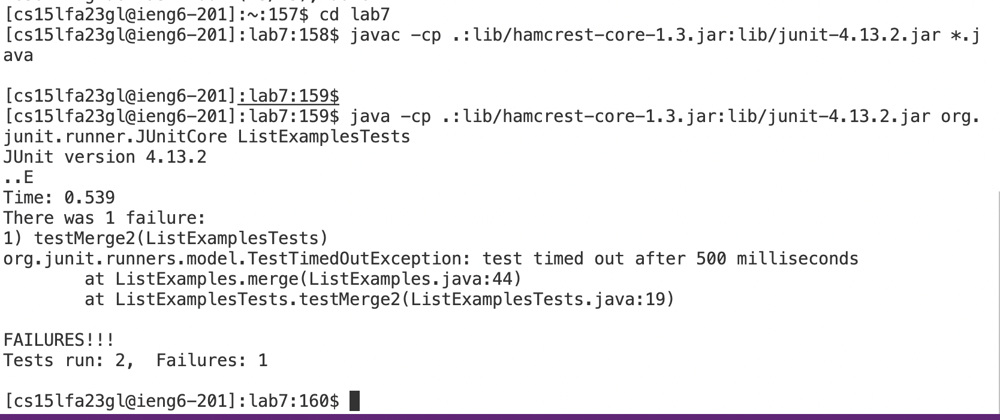
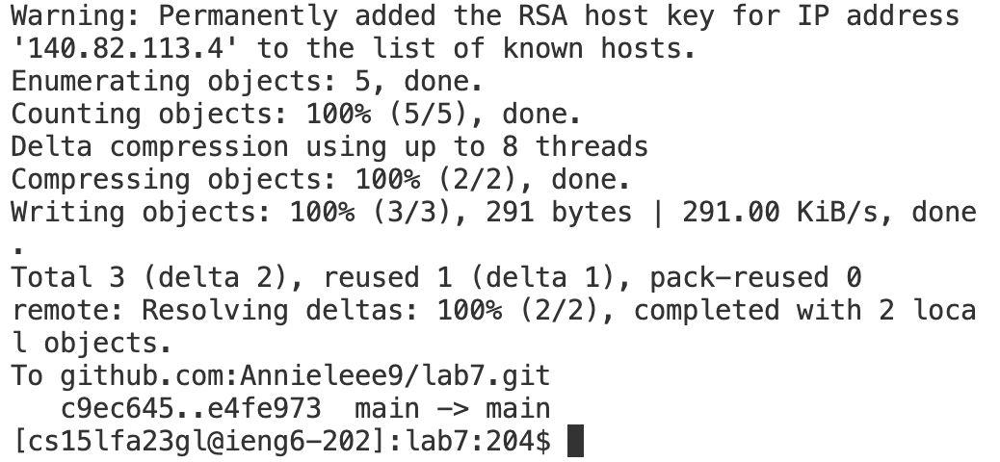

Step1:
press the &lt;up&gt; key five times to get to SSH command and log into ieng6. 
```
annielee@Annie-LEe ~ % ssh cs15lfa23gl@ieng6.ucsd.edu
```
Step2:
 press the &lt;up&gt; key four times to git clone the SSH URL:
```
[cs15lfa23gl@ieng6-203]:~:258$ git clone git@github.com:Annieleee9/lab7.git
fatal: destination path 'lab7' already exists and is not an empty directory.
[cs15lfa23gl@ieng6-203]:~:259$ rm -r lab7
rm: remove write-protected regular file 'lab7/.git/objects/e4/fe973ab3214bf084c8298391bb0861146c41b3'? y
[cs15lfa23gl@ieng6-203]:~:260$ git clone git@github.com:Annieleee9/lab7.git
Cloning into 'lab7'...
remote: Enumerating objects: 67, done.
remote: Counting objects: 100% (31/31), done.
remote: Compressing objects: 100% (17/17), done.
remote: Total 67 (delta 19), reused 17 (delta 14), pack-reused 36
Receiving objects: 100% (67/67), 377.92 KiB | 1.84 MiB/s, done.
Resolving deltas: 100% (25/25), done.
```
Step3:
press the &lt;up&gt; key three times for the cd command:
```
[cs15lfa23gl@ieng6-203]:~:262$ cd lab7
```
Step 4:
press the &lt;up&gt; key two times to run the test javac command:
```
[cs15lfa23gl@ieng6-202]:lab7:188$ javac -cp .:lib/hamcrest-core-1.3.jar:lib/junit-4.13.2.jar *.java
[cs15lfa23gl@ieng6-202]:lab7:189$ java -cp .:lib/hamcrest-core-1.3.jar:lib/junit-4.13.2.jar org.junit.runner.JUnitCore ListExamplesTests
```
Step5:
 vim + &lt;space&gt; key + ListExamples.java
   ```
   [cs15lfa23gl@ieng6-203]:lab7:263$ vim ListExamples.java
   ```
Make changes to ListExamples.java:
Press the &lt;up&gt; key six times to get to our desired line
i + &lt;right&gt; key + &lt;backspace&gt; key + press 2 to replace 1
Press the &lt;esc&gt; key to go back to normal mode
:wq+ &lt;Enter&gt; key to save and exit


Step 6:
 Rerun to demonstrate test successful:
```
[cs15lfa23gl@ieng6-203]:lab7:265$ javac -cp .:lib/hamcrest-core-1.3.jar:lib/junit-4.13.2.jar *.java
[cs15lfa23gl@ieng6-203]:lab7:266$ java -cp .:lib/hamcrest-core-1.3.jar:lib/junit-4.13.2.jar org.junit.runner.JUnitCore ListExamplesTests
JUnit version 4.13.2

..
Time: 0.024

OK (2 tests)
```

Step 7:
Commit and push the resulting change
```
[cs15lfa23gl@ieng6-202]:lab7:190$ git add ListExamples.java
[cs15lfa23gl@ieng6-202]:lab7:191$ git push
```



    
