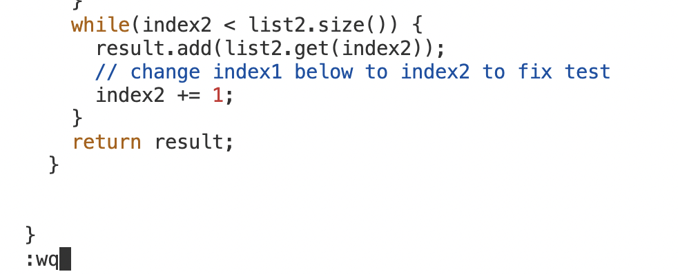

Step1:
```
annielee@Annie-LEe ~ % ssh cs15fa23gl@ieng6.ucsd.edu
```
Step2:
```
[cs15lfa23gl@ieng6-202]:~:185$ git clone git@github.com:Annieleee9/lab7.git
```
Step3:

Step4:
```
[cs15lfa23gl@ieng6-202]:lab7:187$ vim ListExamples.java
```
Step5:

Key Pressed:

1. press the &lt;up&gt; key four times to git clone the SSH URL: git clone git@github.com:Annieleee9/lab7.git
2. press the &lt;up&gt; key three times for the cd command:  cd lab7.
3. press the &lt;up&gt; key two times to run the test javac command: javac -cp .:lib/hamcrest-core-1.3.jar:lib/junit-4.13.2.jar *.java
4. press the &lt;up&gt; key once to run the test: java -cp .:lib/hamcrest-core-1.3.jar:lib/junit-4.13.2.jar org.junit.runner.JUnitCore ListExamplesTests
5. vim + &lt;space&gt; key + ListExamples.java
6. Press the &lt;up&gt; key six times to get to our desired line
7. i + &lt;right&gt; key + &lt;backspace&gt; key + press 2
8. press the &lt;esc&gt; key
9. :wq+ &lt;Enter&gt; key
