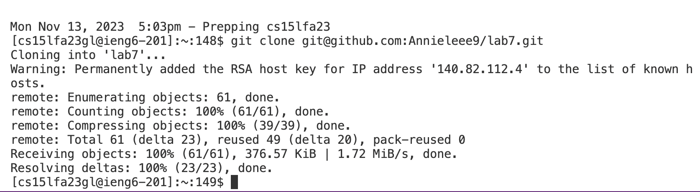

Step1:

Step2:

Step3:

Step4:

Step5:

Key Pressed:

1. <up><up><up><up> to git clone the ssh URL  git@github.com:Annieleee9/lab7.git
2. <up><up><up> to cd into the lab7 directory
3. <up><up> to run the test javac -cp .:lib/hamcrest-core-1.3.jar:lib/junit-4.13.2.jar *.java
4. <up> to run the test java -cp .:lib/hamcrest-core-1.3.jar:lib/junit-4.13.2.jar org.junit.runner.JUnitCore ListExamplesTests
5. vim <space> + ListExamples.java
6. <up> six times to get to our desired line
7. i + <right> + <backspace> + press 2
8. press <esc>
9. :wq+ <Enter>
