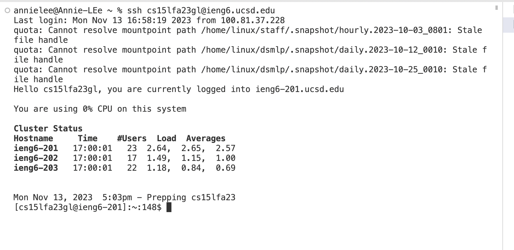

Step1:

Step2:

Step3:

Step4:

Step5:

Key Pressed:
<up><up><up><up> to git clone the ssh URL  git@github.com:Annieleee9/lab7.git
<up><up><up> to cd into the lab7 directory
<up><up> to run the test javac -cp .:lib/hamcrest-core-1.3.jar:lib/junit-4.13.2.jar *.java
<up> to run the test java -cp .:lib/hamcrest-core-1.3.jar:lib/junit-4.13.2.jar org.junit.runner.JUnitCore ListExamplesTests
vim <space> + ListExamples.java
<up> six times to get to our desired line
i + <right> + <backspace> + press 2
press <esc>
:wq+ <Enter>
